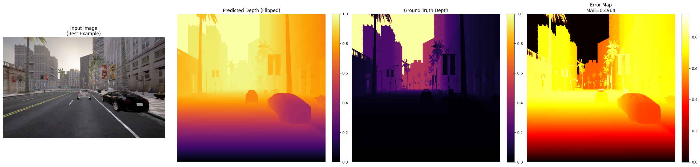
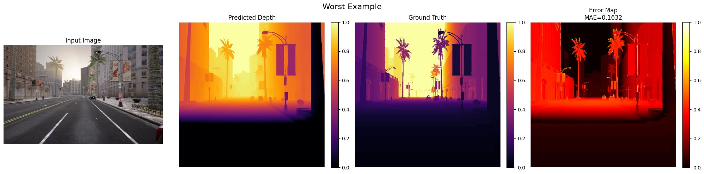
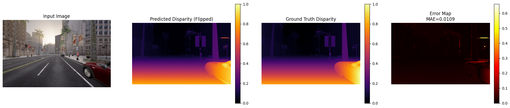
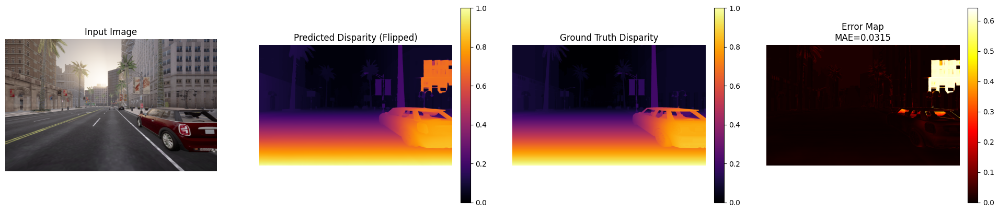

# Depth Estimation on CARLA Dataset

This repository provides an implementation, analysis, and comparison of **Monocular** and **Stereo** depth estimation methods on the **CARLA Simulator** dataset.

---

## Models Used

### 1. Monocular Depth Estimation
- **Model:** Depth-Anything-V2 (ViT-Large)
- **Input:** Single RGB image
- **Output:** Depth map (flipped & normalized to align with ground truth)
- **Use Case:** Lightweight, works with a single camera.

### 2. Stereo Depth Estimation
- **Model:** RAFT-Stereo (SceneFlow Pre-trained)
- **Input:** Left and Right stereo image pairs
- **Output:** Disparity map (normalized to [0,1])
- **Use Case:** High accuracy in structured environments with stereo cameras.

---

## Quantitative Results

| Method        | MAE ↓      | RMSE ↓     | EPE ↓       | Bad-1 ↓    |
| ------------- | ---------- | ---------- | ----------- | ---------- |
| **Monocular** | **0.5266** | **0.5920** | -           | -          |
| **Stereo**    | **1.0023** | **1.0025** | **78.4610** | **99.99%** |

> **Note:** Although stereo is generally expected to be more accurate, these results indicate that the monocular method performed better under this specific configuration. This may be due to normalization or scaling differences in the stereo disparity range.

---

## Qualitative Examples

### Monocular
#### Best Example


#### Worst Example


---

### Stereo
#### Best Example


#### Worst Example


---

## Discussion

### Strengths
- **Monocular:**
  - Lightweight, single-image input.
  - Works without stereo hardware.
- **Stereo:**
  - More geometrically consistent in textured regions.
  - Potentially more accurate with correct disparity scaling.

### Weaknesses
- **Monocular:** Relies heavily on learned priors and struggles in unseen environments.
- **Stereo:** Sensitive to occlusions, repetitive patterns, and reflective or textureless surfaces.

### Failure Cases
- Monocular: Inaccurate depth for distant background objects or flat reflective surfaces.
- Stereo: Errors in repetitive textures, transparent objects, or occluded regions.

### Potential Improvements
- Fine-tune both methods on CARLA-like synthetic domains.
- Combine monocular priors with stereo matching for hybrid estimation.
- Apply post-processing (e.g., left-right consistency checks) to refine stereo disparity maps.

---

## Folder Structure

```

3DCV00-Depth-Estimation/
│
├── monocular/
│   ├── README.md                   # Introduction, results, and instructions for running the monocular method
│   ├── Monocular.ipynb         # Jupyter Notebook: inference, metrics calculation, and visualizations
│   ├── requirements.txt            # Required Python packages for the monocular method
│   └── outputs/                    # Output images (Best, Worst, Error Maps, Sample visualizations)
│       ├── best_example.png
│       ├── worst_example.png
│       └── histogram.png
│
├── stereo/
│   ├── README.md                   # Introduction, results, and instructions for running the stereo method
│   ├── stereo_notebook.ipynb       # Jupyter Notebook: inference, metrics calculation, and visualizations
│   ├── raftstereo-sceneflow.pth    # Pre-trained weights (SceneFlow model)
│   ├── requirements.txt            # Required Python packages for the stereo method
│   └── outputs/                    # Output images (Best, Worst, Error Maps, Sample visualizations)
│       ├── best_example.png
│       ├── worst_example.png
│       └── histogram.png
│
└── README.md                       # Main report comparing Monocular and Stereo (intro, results, discussion)

````

---

## How to Use

1. Clone the repository:
```bash
git clone <your-repo-link>
cd 3DCV00-Depth-Estimation
````
