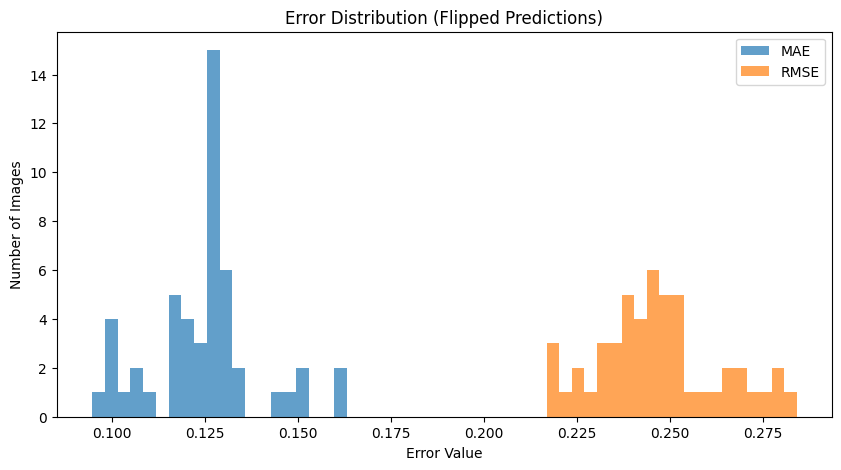

# Monocular Depth Estimation

##  Model Information
- **Model Used:** Depth-Anything-V2 (ViT-Large)
- **Input:** Single RGB image
- **Output:** Depth map (normalized & flipped to align with ground truth)
- **Use Case:** Lightweight and suitable for real-time depth estimation using a single camera.

---

## Quantitative Results

| Metric | Value |
|--------|---------|
| **MAE** | 0.1790 |
| **RMSE** | 0.2466 |
| **AbsRel** | 0.8243 |

*Lower is better for all metrics.*

---

## Qualitative Results

### Best Example


### Worst Example


### Error Distribution


---

## How to Run

1. **Install dependencies**  
Make sure you are in the `monocular` folder, then run:
```bash
pip install -r requirements.txt
````

2. **Run the Notebook**
   Open the Jupyter Notebook and execute all cells:

```bash
Monocular.ipynb
```

3. **Outputs**

* Depth maps will be saved automatically.
* Best, Worst, and Histogram images will be saved in the `outputs/` folder.

---

## Discussion

### **Strengths**

* Lightweight and fast → suitable for real-time applications.
* Works with a single camera (no stereo hardware required).
* Performs reasonably well on CARLA synthetic data.

### **Weaknesses**

* Relies heavily on learned priors → performance may degrade on unseen domains.
* Less accurate for far-distance objects compared to stereo methods.

### **Failure Cases**

* Flat surfaces, reflective objects, and distant background regions often have inconsistent depth values.

### **Potential Improvements**

* Fine-tuning the model on CARLA-like domains to improve accuracy.
* Combining monocular depth priors with stereo matching for hybrid approaches.

---

## Folder Structure

```
monocular/
├── mono_notebook.ipynb     # Full inference, metrics, and visualization
├── requirements.txt        # Required Python packages
└── outputs/                # Predicted depth visualizations
    ├── best_example.png
    ├── worst_example.png
    └── histogram.png
```

