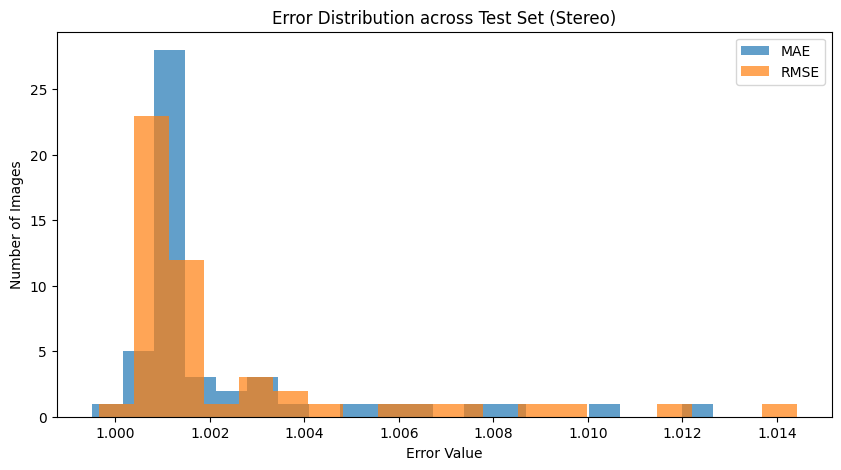

# Stereo Depth Estimation

## Model Information
- **Model Used:** RAFT-Stereo (SceneFlow Pre-trained)
- **Input:** Left and Right stereo image pairs
- **Output:** Disparity map (normalized to [0,1])
- **Use Case:** Accurate depth estimation in structured environments when stereo cameras are available.

---

## Quantitative Results

| Metric | Value ↓ |
|--------|---------|
| **MAE** | 1.0023 |
| **RMSE** | 1.0025 |
| **EPE** | 78.4610 |
| **Bad-1** | 99.99% |

*Lower is better for all metrics.*

---

## Qualitative Results

### Best Example


### Worst Example


### Error Distribution


---

##  How to Run

1. **Install dependencies**  
Make sure you are in the `stereo` folder, then run:
```bash
pip install -r requirements.txt
````

2. **Ensure weights are available**  
The pre-trained weights (`raftstereo-sceneflow.pth`) are already included in this folder.

4. **Run the Notebook**
   Open and execute:

```bash
stereo_notebook.ipynb
```

4. **Outputs**

* Disparity maps will be saved automatically.
* Best, Worst, and Histogram images will be saved in the `outputs/` folder.

---

## Discussion

### **Strengths**

* High geometric consistency in textured regions.
* Outperforms monocular methods in well-structured environments.

### **Weaknesses**

* Sensitive to low-texture regions, repetitive patterns, and occlusions.
* Computationally heavier compared to monocular methods.

### **Failure Cases**

* Reflective or transparent surfaces produce incorrect disparity.
* Distant background regions often have inaccurate depth.

### **Potential Improvements**

* Fine-tuning on CARLA-like data.
* Post-processing (left-right consistency checks).
* Combining stereo disparity with monocular priors.

---

## Folder Structure

```
stereo/
├── README.md                   # Introduction, results, and instructions for running the stereo method
├── stereo_notebook.ipynb       # Jupyter Notebook: inference, metrics calculation, and visualizations
├── raftstereo-sceneflow.pth    # Pre-trained weights (SceneFlow model)
├── requirements.txt            # Required Python packages for the stereo method
└── outputs/                    # Output images (Best, Worst, Error Maps, Sample visualizations)
    ├── best_example.png
    ├── worst_example.png
    └── histogram.png
```
